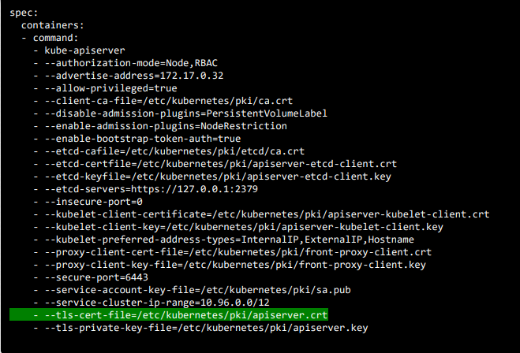
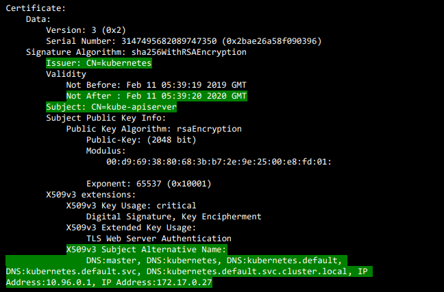

## Security

### TLS CERTIFICATES

#### View Certificate Details 
- TLS Cert 를 확인 하여 클러스터의 구성 정보를 체크
- [정리 엑셀 시트](assets/kubernetes-certs-checker.xlsx)
```
cat /etc/kubernetes/manifests/kube-apiserver.yaml
```


```
openssl x509 -in /etc/kubernetes/pki/apiserver.crt -text -noout
```
